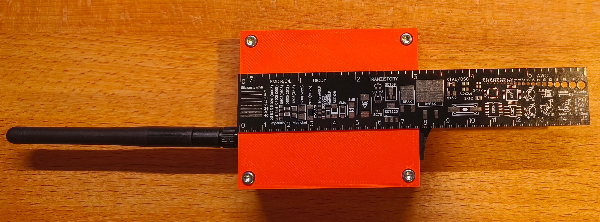
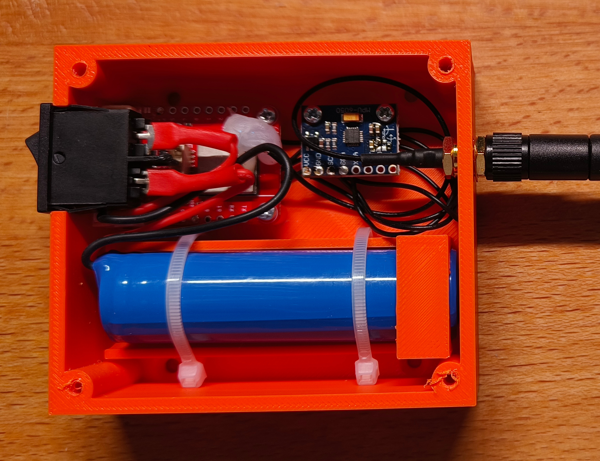

# Garage door notif

Battery-powered detekce otevřených garážových vrat v noci (22:00–06:00) přes ESP32 + MPU6050 + ntfy.sh push notifikace. Cílová životnost na 18650 baterii: **~1 rok mezi nabíjeními** (omezeno self-discharge baterky ~2–4 %/měsíc + kapacitní degradace + chlad v garáži, ne čistou spotřebou ESP).

**Dokumentace:**
- [`USAGE.md`](USAGE.md) — pro koncového uživatele (jak to funguje, co znamenají notifikace, FAQ)

---

## Use case

**Co řešíme:** Detekovat, jestli jsou garážová vrata **otevřená v noci mezi 22:00 a 06:00**, a poslat alert na mobil.

**Klíčový rozdíl proti motion detekci:** vrata mohou být otevřená už od 14:00 a zůstat tak — v 22:00 už žádný motion event nenastane. **Musíme polovat stav, ne čekat na změnu.**

**Design cíle:**
- Alert do ~5 min po 22:00, pokud jsou vrata otevřená
- Alert i během noci, pokud se otevřou
- Battery-powered, žádné kabelování ke garáži
- Životnost **~1 rok** mezi nabíjeními (realistický cíl, ne teoretické maximum)
- Žádný „false positive" z větru / vibrací

---

## Architektura

Timer-based polling (ne motion-driven). ESP probudí RTC každých 5 min, přečte tilt z MPU6050, rozhodne na základě času a stavu, případně pošle notifikaci, vrátí se do deep sleep.

```
COLD BOOT (power-on / RST)
   │
   ├─► WiFi + NTP sync
   ├─► MPU baseline capture (50 vzorků, průměr — předpoklad: vrata zavřená)
   ├─► Boot notifikace na ntfy.sh
   └─► ESP+MPU deep sleep, wake za 5 min
                    │
                    ▼
WAKE CYCLE (každých 5 min)
   │
   ├─► Wake MPU přes I²C (clear SLEEP bit, wait 30 ms)
   ├─► Read accel × 6 (zahod první, průměr ze zbylých 5)
   ├─► Spočti tilt vůči baseline (3D úhel)
   ├─► MPU zpět do SLEEP mode (5 µA)
   │
   ├─► Hystereze: open >60°, close <40° (stav v RTC mem)
   │
   ├─► Časová logika:
   │     ├─ 22:00-06:00 + open + rate limit OK (4 min) → URGENT alert
   │     ├─ hodina 21 + heartbeat dnes neodeslán      → daily heartbeat
   │     ├─ poslední NTP sync >24h                    → opportunistic refresh
   │     └─ MPU error queue má pendingy               → error report
   │
   ├─► Pokud potřeba WiFi: connect → ntp_sync (zadarmo) → poslat → disconnect
   └─► ESP+MPU deep sleep, wake za 5 min
```

### Klíčové principy

1. **Timer wake (RTC), ne motion wake (MPU INT)** — vrata stojí staticky, motion event se nestane.
2. **MPU drží v SLEEP mode (5 µA) mezi měřeními** — ESP probudí přes I²C jen na ~50 ms při wake.
3. **Hystereze + průměr** — proti vibracím / větru. První sample po wake je outlier (zahodit).
4. **Rate limiting alertů 4 min** — pri stuck-open vratech alert každý wake cyklus (~5 min), neoslepí appku ale informuje opakovaně.
5. **NTP sync 1× za 24 h + opportunistic** — pokaždé když už máme WiFi (alert/heartbeat), syncneme i čas zadarmo.
6. **State v RTC slow memory** — baseline, alert/heartbeat trackery, error queue, hysteresis stav přežívají deep sleep, ne power-off.
7. **Errors přes ntfy** — jediný komunikační kanál, takže senzor failures se queueují a posílají při příští WiFi příležitosti.

---

## Hardware



*Hotové zařízení (varianta s externí anténou) — 3D tištěná krabička 7×8×3 cm, vlevo viditelná externí anténa 2,4 GHz na pigtailu.*

> **Pozor — LaskaKit ESP32-C3-LPKit v4 existuje ve dvou variantách:**
> 1. **S integrovanou PCB anténou** — plug-and-play, stačí samotná deska. Vhodné pokud AP je v rozumné vzdálenosti (~10 m, přes 1 zeď).
> 2. **S u.FL/IPEX konektorem pro externí anténu** — bez antény nepřijímá WiFi! Nutné dokoupit **pigtail U.FL ↔ SMA** + **externí anténu 2,4 GHz** (řádky níže v BOM). Větší dosah, vhodné kdy AP přes víc zdí nebo dál.
>
> Při objednávce ověřit kterou variantu máš — popis na LaskaKit produktové stránce nemusí být jednoznačný, podle revize. Pokud nevíš, podívej se na fotku desky: PCB anténa = klikatý měděný motiv u rohu modulu; externí varianta má malý stříbrný konektor.

### BOM

| Položka | Cena | Pozn. |
|---|---:|---|
| **[LaskaKit ESP32-C3-LPKit v4](https://www.laskakit.cz/laskkit-esp-12-board/)** (board ID `esp32-c3-devkitm-1`) | 298 Kč | ESP32-C3 (RISC-V), nativní USB-CDC bez externího USB-Serial čipu, on-board WS2812 NeoPixel RGB LED (GPIO9), JST-PH 2.0 + integrovaný LiPo charger, low-quiescent LDO se softwarovým `PERIPH_EN` switchem (GPIO4) pro perif. rail. Sleep proud naměřeno **19 µA** — viz [Spotřeba](#spotřeba). Antenna varianta — viz poznámka nad tabulkou. |
| **[Pigtail U.FL ↔ SMA female, 15 cm](https://www.laskakit.cz/pigtail-u-fl-sma-female--kabel-1-13mm--15cm/)** *(jen u externí antény)* | 38 Kč | Propojení on-board U.FL/IPEX konektoru s externí anténou přes SMA spoj. Nutné jen u varianty desky bez integrované PCB antény. |
| **[Anténa 2,4 GHz 10 cm SMA](https://www.laskakit.cz/antena-10cm-2-4g/)** *(jen u externí antény)* | 88 Kč | NiceRF SW2400-ZD115. Šroubuje se na pigtail. Lepší dosah než on-board PCB anténa — vhodné pokud je AP daleko nebo přes zdi. |
| **[GY-521 MPU6050 / MPU6500](https://www.laskakit.cz/arduino-gyroskop-a-akcelerometr-gy-521--mpu6050/)** (akcelerometr) | 98 Kč | 6-axis IMU, I²C adresa `0x68`, on-board 3,3 V LDO + 4,7 kΩ pull-upy na SDA/SCL. Silkscreen říká „MPU6050", v praxi často osazeno **MPU-6500** (WHO_AM_I=0x70) — firmware detekuje a akceptuje obě varianty. Zelená status LED na modulu odpájet (1,44 mA always-on). |
| **[LaskKit GeB Li-Ion 18650 1S1P 3,7 V 3200 mAh](https://www.laskakit.cz/geb-li-ion-baterie-1x18650-1s1p-3-7v-3200mah/)** | 188 Kč | 18650 cell s integrovanou ochranou (over-discharge / over-current). Nabíjí se přes USB-C C3-LPKit (on-board charger). JST-PH 2.0 konektor. |
| **Spínač / tlačítko v sérii s baterií** | ~20 Kč | Rozepíná napájení z baterie — slouží k vynucenému cold bootu (zachycení nové baseline po instalaci, viz boot notifikace). Bez fyzického přístupu k RST tlačítku po zavření krabičky. |
| **Šroubky (M3 + M2.5)** | ~20 Kč | 4× M3 imbus pro víko krabičky + 2× M2.5 self-tap pro ESP modul + 2× M2.5 pro MPU. |
| **3D tištěná krabička** | ~30 Kč | OpenSCAD model `3dprint/`, průzor ve víku pro NeoPixel indikaci. MPU musí být pevně přichycena k vratům, ne k rámu (jinak měří pohyb rámu, ne dveří). Cena materiálu (PLA, ~30 g). |

Propojení MPU ↔ ESP: 4 drátky (VCC, GND, SDA, SCL) připájené přímo na pájecí pady — bez DuPont konektoru, pevnější vůči vibracím.

**Celkem:** ~660 Kč (s integrovanou PCB anténou) / ~790 Kč (s externí anténou).

### Pin allocation (LaskaKit ESP32-C3-LPKit v4 — aktuální)

| GPIO | Funkce | Pozn. |
|---|---|---|
| 0 | ADC — Vbat sense | on-board divider ×1.769, použít `analogReadMilliVolts()` (viz silkscreen v4.0) |
| 4 | `PERIPH_EN` — power switch perif. rail | HIGH = napájena MPU + NeoPixel; LOW = oboje off. `gpio_hold_en` pro persistenci přes deep sleep |
| 6 | I²C SDA → GY-521 SDA | volný GPIO bez kolize se strapping/USB/UART |
| 7 | I²C SCL → GY-521 SCL | volný GPIO bez kolize |
| 9 | on-board WS2812 NeoPixel (RGB LED) | jediný indikátor stavu; GPIO9 by jinak byl BOOT strapping, na C3-LPKit obsazený LED |
| 20 | UART0 RX | volné, lze využít pro externí USB-UART monitor při battery měření |
| 21 | UART0 TX | volné, lze využít pro externí USB-UART monitor při battery měření |

Obsazené čipem / deskou: USB-C přes nativní USB-CDC (GPIO18/19), 32 kHz krystal (interní RC), Flash (GPIO11–17 interní v ESP32-C3-MINI-1 modulu).

### Zapojení MPU6050 / MPU6500 ↔ ESP32-C3-LPKit v4

GY-521 modul napájíme **z PERIPH_EN railu** (přes GPIO4 power switch) — v deep sleep tak MPU dostane 0 V a nemusíme ji explicitně uspávat přes I²C kvůli sleep proudu.

| GY-521 pin | C3-LPKit pin | Pozn. |
|---|---|---|
| VCC | 3V3 | jakýkoli 3V3 pin na headeru — všechny jsou za PERIPH_EN switchem |
| GND | GND | jakýkoli GND pin |
| SDA | GPIO6 | I²C data |
| SCL | GPIO7 | I²C clock |
| AD0 | nezapojeno | → I²C adresa **0x68** (default pull-down na GY-521 modulu) |
| INT | nezapojeno | timer wake, ne motion interrupt |
| XCL, XDA | nezapojeno | aux I²C master pro magnetometr — nepoužívá se |

Pull-up rezistory pro I²C jsou integrované na GY-521 modulu (4.7 kΩ na SDA i SCL), externí netřeba.

**MPU chip:** silkscreen modulů obvykle říká `MPU6050`, ale GY-521 se prodávají s oběma — MPU-6050 (WHO_AM_I=0x68) i MPU-6500 (0x70). Firmware akceptuje 0x68/0x70/0x71/0x73 (MPU-6050/6500/9250/9255), register layout je v naší podmnožině (accel + temp) kompatibilní.

### Sestavení v krabičce



Layout uvnitř (z fotky):
- **Vlevo nahoře:** kolébkový spínač v -X stěně, pájené přímo na baterii (rozpojuje +pól)
- **Vlevo nahoře vedle:** ESP32-C3-LPKit přišroubovaný k +X stěně, USB-C přístupný zvenku
- **Vpravo nahoře:** GY-521 MPU modul přišroubovaný na +Y stěnu, 4 pájené drátky do ESP
- **Vpravo střed:** U.FL pigtail s SMA bulkhead konektorem do +X stěny, externí anténa zvenku
- **Dole:** 18650 baterie v U-kanálu, fixovaná dvěma zip-ties přes víko

---

## Jak to spustit

| Cíl | Příkaz |
|---|---|
| **Finální app** (default) | `pio run -t upload -t monitor` |
| Jen build (bez upload) | `pio run` |
| Jen monitor (bez flash) | `pio device monitor` |
| Vyčistit build cache | `pio run -t clean` |

Port: `/dev/ttyUSB0`. Baud: 115200.

Debug moduly a vývojářské nástroje viz sekce [Debug — vývojářské nástroje](#debug--vývojářské-nástroje) na konci.

---

## Struktura projektu

```
src/main.cpp              ← finální integrovaná aplikace (env: app)
debug/
  ntfy/main.cpp           ← WiFi + NTP + ntfy + Vbat status loop
  tilt/main.cpp           ← MPU6050 baseline + tilt monitoring
  sleep/main.cpp          ← ESP+MPU deep sleep + RTC mem
include/
  secrets.h               ← WiFi heslo, ntfy topic (NEVERZOVÁNO)
  secrets.h.example       ← šablona
platformio.ini            ← envs: app (default), tilt, ntfy, sleep
USAGE.md                  ← uživatelský návod
```

Filozofie: každý debug modul je samostatně flashovatelný firmware, izolovaně testuje jednu věc. Finální `src/main.cpp` skládá funkce z odladěných modulů.

---

## Co dělá hlavní app

State persistovaný přes deep sleep v RTC slow memory (`RTC_DATA_ATTR`):
boot_count, baseline vector, door_was_open, last_alert_unix, last_heartbeat_yday, last_ntp_unix, error queue (count + last message).

**Cold boot** (po zapnutí / RST):
1. WiFi connect + NTP sync (CET/CEST automaticky přes POSIX TZ)
2. MPU6050 baseline capture (50 vzorků, průměr, předpoklad zavřených vrat)
3. Boot notifikace nebo error report na ntfy.sh
4. ESP+MPU deep sleep, wake za 5 min

**Wake cyklus** (každých 5 min) — viz [Architektura](#architektura) výše.

Detaily v hlavičce `src/main.cpp`.

### Typy notifikací

| Událost | Title | Priority | Tag |
|---|---|---|---|
| Cold boot | Hlidac garazovych vrat aktivni | default | rocket |
| Vrata otevřená 22-06 | GARAZ OTEVRENA! | **urgent** | rotating_light |
| Denní kontrola 21:00 | Garaz - denni kontrola | low | white_check_mark / yellow_circle / battery |
| Senzor / baseline error | Hlidac vrat - CHYBA | high | warning |

Detaily a uživatelský pohled v [`USAGE.md`](USAGE.md).

---

## Secrets

Citlivé údaje (WiFi heslo, ntfy topic) jsou v `include/secrets.h`, **neverzuje se** (.gitignored). Pro nový clone:

```bash
cp include/secrets.h.example include/secrets.h
# uprav WIFI_SSID, WIFI_PASS, NTFY_TOPIC v include/secrets.h
```

Soubor se kompiluje přímo do binárky přes `#include "secrets.h"` v `src/main.cpp`.

---

## ntfy.sh

- Topic: `milan-garaz-2026-x8kf3pq7vn` (random, regenerovat před deploymentem)
- Free tier: 60 burst / replenish 1 každých 5 s = ~17k/den max
- Web subscriber pro test bez appky: `https://ntfy.sh/<topic>`
- Server-side history (12 h): `curl 'https://ntfy.sh/<topic>/json?poll=1&since=1h'`

```bash
# poslat testovací zprávu
curl -d "test" -H "Title: Test" ntfy.sh/milan-garaz-2026-x8kf3pq7vn

# přečíst historii za poslední hodinu
curl -s "https://ntfy.sh/milan-garaz-2026-x8kf3pq7vn/json?poll=1&since=1h"
```

---

## Spotřeba

### Teoretická predikce

| Komponenta | Spotřeba | Pozn. |
|---|---|---|
| ESP32-C3 deep sleep | ~5–10 µA | datasheet, sám čip |
| MPU6050/6500 — rail off | 0 µA | PERIPH_EN=LOW odřízne |
| Wake event (no WiFi) | ~25 mA × ~5 s | MPU read + tilt compute |
| Alert / heartbeat (s WiFi) | ~80 mA × 5 s | NTP + HTTP POST |

**Denní budget** (předpoklad: 288 wake/den, ~5 alert/heartbeat events/den):

| Položka | Výpočet | Energie/den |
|---|---|---|
| ESP32-C3 deep sleep | 24 h × 19 µA × 3,3 V | 1,5 mWh |
| 288 wake × 5 s | 25 mA × 3,3 V × 1440 s | 33 mWh |
| 5 WiFi events × 5 s | 80 mA × 3,3 V × 25 s | 1,8 mWh |
| **Σ celkem** | | **~36 mWh/den** |

**Teoretické maximum** (čistě výpočet ze spotřeby, ESP32-C3 + odpájené LED):

| Baterie | Kapacita | Teoretická životnost |
|---|---|---|
| 1000 mAh LiPo | ~3,7 Wh | ~1,7 roku |
| **18650 3200 mAh** ([LaskKit GeB](https://www.laskakit.cz/geb-li-ion-baterie-1x18650-1s1p-3-7v-3200mah/)) | ~11,8 Wh | ~5,5 let |

**Realistický cíl: ~1 rok mezi nabíjeními** na 18650. Teoretické maximum je výrazně optimistické, reálnou životnost limitují:

- **Self-discharge baterie** ~2–4 %/měsíc = ~25–40 % kapacity ztracené čistě sezením za rok
- **Kapacitní degradace Li-Ion** ~3–5 %/rok stárnutím (i bez cyklování)
- **Chlad v zimní garáži** (0 °C) snižuje efektivní kapacitu o ~20–30 %
- **Protection cutoff baterky** zastaví ESP při ~3,0 V, nevyužije se posledních ~5–10 % kapacity
- **Reálné wake events** typicky 2–3× teoretická hodnota (retries, error events, NTP timeouty)

➜ Plánovat **nabíjení 1× ročně** je realistický cíl. „5,5 let" je horní strop matematiky, ne reálné očekávání.

### Naměřené hodnoty (LaskaKit ESP32-C3-LPKit v4)

Setup: baterie přes JST → multimetr v sérii → C3-LPKit v4 + GY-521 (zelená LED odpájena, MPU napájena přes `PERIPH_EN` rail = GPIO4). Firmware: `debug/c3sleep/main.cpp` (`AWAKE_HOLD_MS = 5000`, `SLEEP_DURATION_S = 30`, NeoPixel brightness 40/255 jasně červená). `gpio_hold_en(GPIO4)` drží `PERIPH_EN=LOW` přes deep sleep → MPU a NeoPixel rail odpojený.

| Konfigurace | Active hold | Deep sleep | Pozn. |
|---|---|---|---|
| C3-LPKit v4 + GY-521 (NeoPixel on) | **24 mA** | **19 µA** | MPU napájena z PERIPH_EN, neuspána přes I²C |

Active proud (24 mA) = ESP32-C3 active ~10 mA + NeoPixel ~10 mA + MPU6500 active ~4 mA. Při deep sleep `PERIPH_EN=LOW` odřízne NeoPixel i MPU rail → vidíš čistě C3 + LDO + charger IC quiescent.

Sleep mAh/den: **19 µA × 24 h = 0,46 mAh/den**. Při 18650 3200 mAh teoretické maximum (jen sleep, bez wake events) ~7 000 dní (~19 let) — v praxi limitováno self-discharge baterie a kapacitní degradací; viz Wake interval tabulka níže.

### Wake interval vs. životnost

Otázka: jak se mění životnost, pokud probouzím častěji? Předpoklad: počet odeslaných zpráv (alerty + heartbeat) zůstává konstantní ~5/den, mění se jen frekvence MPU read cyklů bez WiFi.

**Vstupy** (z naměřených / teoretických hodnot výše):
- Wake bez WiFi: 50 mA × 0,2 s = **0,00278 mAh/wake**
- WiFi event: 80 mA × 5 s = 0,111 mAh × 5/den = **0,56 mAh/den**
- Sleep ESP32-C3 + MPU rail off (PERIPH_EN=LOW) **naměřeno 19 µA** × 24 h = **0,46 mAh/den**
- Self-discharge 18650 (3 %/měs ze 3200 mAh) = **3,2 mAh/den**
- Kapacita: 3200 mAh

| Wake int. | Wakes/den | Wake E [mAh] | Sleep [mAh] | WiFi [mAh] | Self-disch. [mAh] | **Σ/den** | **Životnost** |
|---:|---:|---:|---:|---:|---:|---:|---:|
| 1 min  | 1440 | 4,00 | 0,48 | 0,56 | 3,2 | **8,24** | ~388 dní (~1,06 r) |
| 2 min  | 720  | 2,00 | 0,48 | 0,56 | 3,2 | **6,24** | ~513 dní (~1,40 r) |
| 5 min  | 288  | 0,80 | 0,48 | 0,56 | 3,2 | **5,04** | ~635 dní (~1,74 r) |
| 10 min | 144  | 0,40 | 0,48 | 0,56 | 3,2 | **4,64** | ~690 dní (~1,89 r) |
| 20 min | 72   | 0,20 | 0,48 | 0,56 | 3,2 | **4,44** | ~721 dní (~1,98 r) |
| 30 min | 48   | 0,13 | 0,48 | 0,56 | 3,2 | **4,37** | ~732 dní (~2,00 r) |

**Insight: self-discharge ~3,2 mAh/den je floor, který nelze podlézt.** Sleep + zprávy přidají dalších ~1,0 mAh/den (taky fixní). Variabilní část = wake events:

- **5 min** (aktuální): 0,80 mAh/den, +25 % nad floor — rozumný kompromis
- **2 min**: 2,0 mAh/den, +62 % nad floor — znatelný hit (cena: −24 % životnosti vs. 5 min)
- **1 min**: 4,0 mAh/den, +125 % nad floor — wake events už dominují nad samovybíjením

➜ Mezi „self-discharge převažuje" a „wake events převažují" je hranice **někde mezi 2 a 5 min wake intervalem**. Pod 5 min jdeme rapidně dolů, nad 5 min už další zpomalování přínos nedává (rozdíl 5 → 30 min je jen ~15 % životnosti).

**Caveats:** kalkulace neuvažují kapacitní degradaci (~3–5 %/r), chlad v zimě (−20–30 % efektivní kapacity) ani stuck-open scénář (vrata nechaná otevřená přes noc → ~120 alertů přes rate-limit → ~13 mAh extra v jedné noci). Reálná životnost bude o 20–40 % nižší.

Při naměřeném sleep proudu 19 µA (= 0,46 mAh/den) je projekce realistická — wake interval má reálný dopad: 5 min = 1,74 r, 30 min = 2,00 r. Self-discharge zůstává nepřekročitelný floor.

