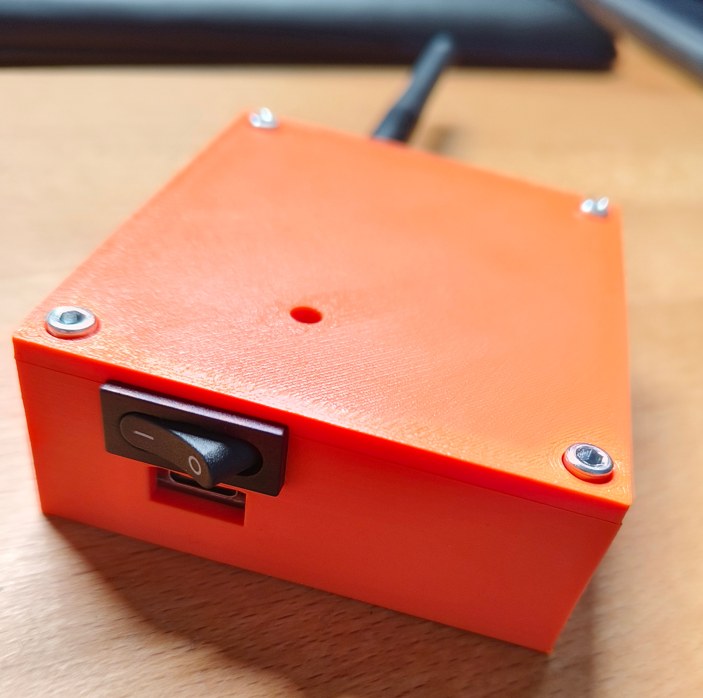
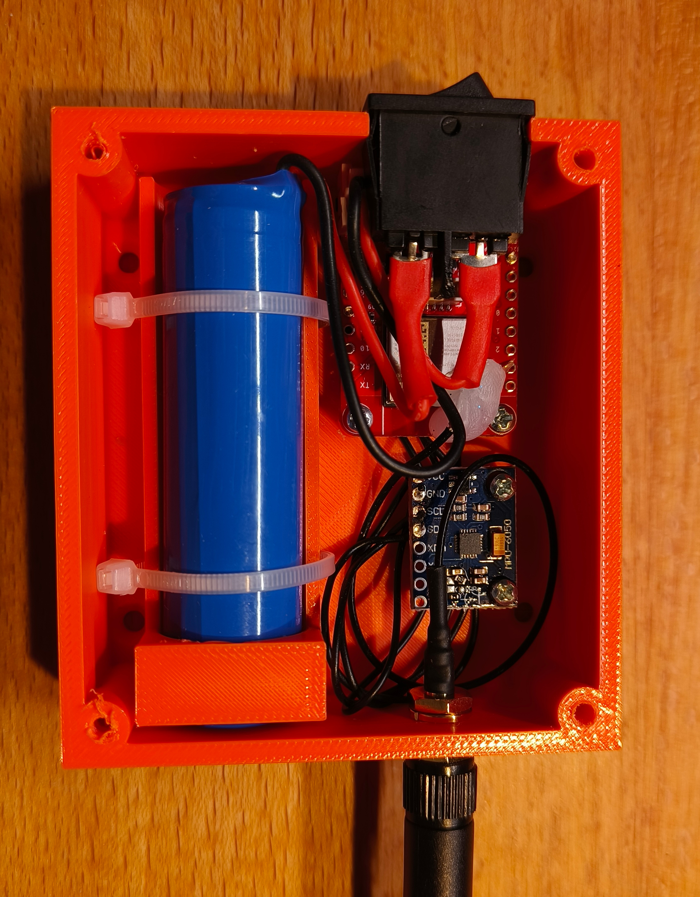
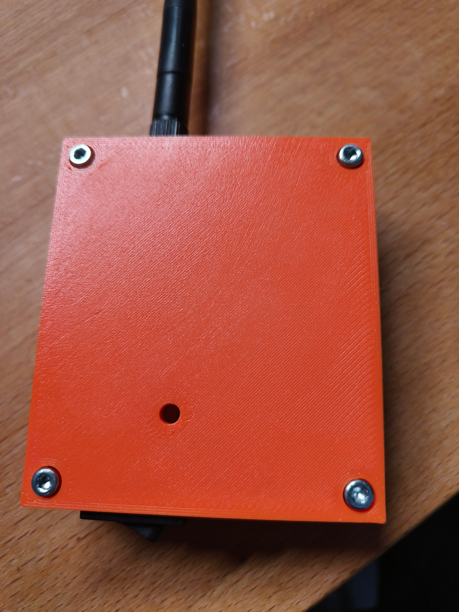

# Garážový hlídač — uživatelský návod

> Tenhle návod je psaný pro běžného uživatele, ne pro techniky.
> Vysvětluje co zařízení dělá, jaké zprávy budete dostávat a co s nimi.

---

## Co to je a co to dělá



V garáži je malé zařízení (ESP32 + senzor náklonu) připevněné k vratům. Běží na baterii, která vydrží **dlouho** (řádově měsíce až roky podle typu baterie).

**Jeho jedinou prací je hlídat: jsou vrata otevřená v noci?**

Pokud ano (mezi **22:00 a 06:00**, nebo dle nastavení), pošle vám okamžitou notifikaci na mobil. Mimo tuto dobu vás zařízení neotravuje — předpokládá se, že přes den s vraty pracujete normálně.

Notifikace chodí přes službu **ntfy.sh** (free, žádný účet, jen appka v telefonu).

---

## První nastavení (instalace)

Zařízení po prvním zapnutí spustí konfigurační WiFi „hotspot" — připojíte se k němu telefonem, vyplníte formulář, zařízení se restartuje a začne fungovat. Postup:

### 1. Nainstalujte si aplikaci ntfy.sh

Najdete pod názvem **ntfy** (autor Philipp Heckel) v:
- 📱 **Google Play** (Android): https://play.google.com/store/apps/details?id=io.heckel.ntfy
- 🍎 **App Store** (iOS): https://apps.apple.com/app/ntfy/id1625396347

Aplikace je zdarma, **bez registrace**, bez reklam. Stačí ji nainstalovat, pak ji použijete v kroku 6.

### 2. Zapněte zařízení

Pokud má spínač, zapněte ho. Pokud má baterii s konektorem, připojte.

Po zapnutí by se měla **LED dioda (skrze průzor ve víku) začít rozblikávat modře** — trojitý blik každé 3 s. To je **konfigurační režim** — zařízení čeká na konfiguraci (10 minut, pak usne a zkusí znovu při dalším probuzení).

> Pokud LED svítí modře pevně 5–10 s a pak zhasne / přeblikne na zelenou nebo červenou, zařízení **už je nakonfigurované** z dřívějška. Pokud chcete přenastavit, viz sekce „Resetování konfigurace" níže.

### 3. Připojte telefon na WiFi zařízení

V telefonu otevřete WiFi nastavení. V seznamu sítí najděte **„garaz-XXXXXX"** (kde XXXXXX je 6 hex znaků unikátní pro vaše zařízení — např. `garaz-235CE8`).

Síť je **otevřená, bez hesla**. Klepněte na ni a připojte se. Telefon může vypsat varování „Tato síť nemá přístup k internetu" — to je v pořádku, my chceme jen otevřít konfigurační stránku.

### 4. Otevřete konfigurační stránku

V prohlížeči zadejte adresu:

```
http://192.168.4.1
```

Měl by se zobrazit formulář **„Hlídač vrat — konfigurace"**.

### 5. Vyplňte formulář

| Pole | Co tam napsat |
|------|---------------|
| **WiFi síť (SSID)** | Vyberte ze seznamu vaši domácí WiFi. (Pokud chybí, znovu načtěte stránku — zařízení nascanovalo sítě.) |
| **Heslo WiFi** | Heslo k vaší domácí WiFi. |
| **ntfy.sh topic** | Předvyplněný náhodný kód, např. `garaz-48F6EE-235CE8`. ⚠️ **Tento kód si zapamatujte / opište** — budete ho potřebovat v kroku 6. Můžete ho nechat předvyplněný, nebo nahradit vlastním (10+ znaků, ne slovník — topic je veřejný, kdokoli kdo ho zná, vidí vaše notifikace). |
| **Název zařízení** | Libovolné, např. „garaz" nebo „domeček". Pro vaši orientaci, kdybyste měli víc zařízení. |
| **Začátek nočního okna** | Hodina kdy začnou alerty. Default `22`. |
| **Konec nočního okna** | Hodina kdy alerty skončí. Default `6`. |
| **Hodina denní kontroly** | Kdy přijde heartbeat „žiju" (jednou denně). Default `21`. |
| **Interval kontroly** | Jak často zařízení měří náklon. Default `300` (5 min). |

Klepněte **„Uložit a otestovat WiFi"**.

Zařízení teď zkusí připojit se k vaší WiFi (~15 s). Pokud heslo nesedí, dostanete chybu a můžete zkusit znovu. Pokud OK, zobrazí se „✅ Uloženo" a zařízení se samo restartuje.

### 6. Subscribe v aplikaci ntfy.sh

Po restartu telefonu (cca 10 s) se telefon sám odpojí od „garaz-XXXXXX" (síť přestane existovat). Připojte ho zpět na vaši **domácí WiFi**.

V aplikaci **ntfy**:
1. Klepněte na **+** vpravo dole (přidat subscription)
2. Do pole **„Topic name"** vložte topic z kroku 5 (např. `garaz-48F6EE-235CE8`)
3. **„Server"** nechte na `ntfy.sh` (default)
4. Klepněte **„Subscribe"**

### 7. Ověření že to funguje

Po restartu (kroku 5) by mělo zařízení během cca 10 sekund:
- 🟢 **Zelená LED svítí 5 s** (pokud vše OK) → poslalo se „Hlidac garazovych vrat aktivni"
- 🔴 **Červená LED svítí 5 s** (pokud něco selhalo) → zkontrolujte hesla/topic, opakujte krok 5

Současně by vám měla **dorazit notifikace „Hlidac garazovych vrat aktivni"** v ntfy.sh aplikaci. Otevřete ji a uvidíte stav baterie, signál a aktuální orientaci.

**Pokud notifikace nedorazila** ani po 30 s a LED svítí zeleně:
- Zkontrolujte, že je topic v aplikaci ntfy přesně stejný jako ten ve formuláři (case-sensitive!)
- Zkontrolujte že telefon je na WiFi (pokud na mobilních datech, taky funguje)

### 8. Test detekce náklonu (volitelné, doporučené)

Než zařízení namontujete na vrata, otestujte si že detekce funguje. Buď:
- **Reálný test (počká do noci):** namontujte, otevřete vrata po 22:00 (nebo dle nastavení) — měl by přijít alert.
- **Rychlý test (hned):** přes konfiguraci nastavte „Začátek nočního okna" na aktuální hodinu, pak nakloňte zařízení o 90° (na bok). Při příští kontrole (do ~5 min, podle intervalu) dorazí alert „GARAZ OTEVRENA!". Vraťte zařízení do původní polohy a okno alertu vraťte na 22.

### Resetování konfigurace

Pokud chcete změnit nastavení (jiná WiFi, jiný topic) nebo zařízení znovu nakonfigurovat:

1. **Vypněte zařízení** spínačem.
2. **Propojte piny RX a TX** na headeru (na silku označené `RX` a `TX`, případně `GPIO20` a `GPIO21` — jsou to dva sousední piny, dají se zkratovat 2-pin jumperem nebo kouskem drátu).
3. **Zapněte zařízení.**
4. LED začne **modře blikat trojitě** = AP režim aktivní. Pokračujte krokem 3 výše.

Po nakonfigurování spínač vypněte, jumper odeberte (jinak se AP režim spustí znovu při dalším zapnutí), spínač zapněte → normální provoz.

---

## Jaké notifikace budete dostávat

Existují **4 druhy** zpráv, podle situace:

### 🚀 „Hlidac garazovych vrat aktivni" — po zapnutí

Pošle se jednou, hned po tom co zařízení nastartuje (zapnutí spínače, výměna baterie, první instalace).

**Co v ní stojí:**
```
Čas: 17:23:45
Baterie: 95 % (4,18 V)
Signál: ▮▮▮▮▮ (-54 dBm)

Reference zavřených vrat zachycena.
Orientace: leží naplocho (Z dominantní) (3° od horizontály).

Pokud orientace neodpovídá realitě (vrata mají být zavřená při instalaci),
při zavřených vratech zařízení vypnout a zapnout — uloží se nová reference.
```

**Co to znamená:**
- Zařízení se nastartovalo, čas se synchronizoval, baterie nabitá, WiFi v pohodě
- „Reference zachycena" = senzor si zapamatoval aktuální polohu vrat jako „zavřeno"
- Pokud orientace v zprávě neodpovídá skutečné poloze zavřených vrat (např. píše „leží naplocho" ale vrata jsou vlastně otevřená), zařízení v zavřené poloze **vypnout a znovu zapnout** spínačem — uloží se nová reference
- Pokud tahle zpráva nepřišla, něco selhalo — projděte sekci „Co dělat když..."

### 🚨 „GARAZ OTEVRENA!" — urgentní v noci

Jediná zpráva která má **urgent** prioritu (na iPhone i Androidu obejde tichý režim, rozsvítí displej).

**Kdy přijde:**
- Mezi 22:00 a 06:00 (nebo dle nastavení)
- Vrata jsou otevřená (náklon > 60° od původní polohy)
- **Při každé kontrole** (cca každých 5 min, dokud vrata nezavřete) — chceme abyste byli upozorněni opakovaně, ne jednou a dost

**Co v ní stojí:**
```
Čas: 22:30
Náklon: 67° (limit 60°)
Baterie: 85 %

Zkontroluj vrata.
```

**Co dělat:** zkontrolujte garáž. Buď fyzicky, nebo přes kameru / sousedy.

> Pokud zařízení ztratilo synchronizaci času (např. WiFi výpadek delší dobu), místo času v notifikaci uvidíte `Čas: (čas neznámý)`. Alert přesto pošle — bezpečnostní funkce funguje i bez přesného času.

### ✅ „Garaz - denni kontrola" — denní heartbeat

Posílá se **jednou denně, od 21:00**. Pokud bylo zařízení ve 21:00 zaneprázdněné (poslední alert, WiFi sync), dorazí o pár minut později. Nikdy ne dříve.

**Smysl:** ověření že zařízení žije a senzor funguje. **Pokud ji jeden den nedostanete, něco se pokazilo** — vybitá baterie, mrtvý ESP, vypnutá WiFi.

**Co v ní stojí:**
```
Čas: 21:00
Stav: ZAVŘENO
Náklon: 2°
Baterie: 87 % (4,10 V)
Signál: ▮▮▮▮▯ (-67 dBm)
Běží: 47d 3h 12m

Pokud tato denní kontrola někdy nedorazí, něco se pokazilo — zkontroluj zařízení.
```

### ⚠️ „Hlidac vrat - CHYBA" — diagnostické chyby

Pošle se když zařízení detekuje problém — typicky **senzor přestal odpovídat**. Priority `high` (důraznější než heartbeat, ale ne urgent).

**Kdy přijde:**
- Senzor nereaguje (uvolněný kabel? rozbitý modul?)
- Reference nebyla zachycena po startu (vypnutí/zapnutí proběhlo špatně)
- WiFi výpadek 3× po sobě (zařízení bylo offline) — pošle se na prvním reconnectu
- Aby vás chyby nezahltily, posílají se nejvýš jednou za **30 minut**

**Co v ní stojí:**
```
Čas: 14:23
Počet chyb od posledního hlášení: 3
Poslední: Senzor nereaguje (probuzení selhalo po 3 pokusech)
Baterie: 87 %
Signál: ▮▮▮▮▯ (-67 dBm)

Chyby se opakují — pravděpodobně skutečný problém.
Zkontroluj připojení senzoru (4 vodiče), případně vyměň modul.
```

**Co dělat:** otevřete krabičku (vyšroubujte 4 šroubky ve víku), zkontrolujte:



- Jsou všechny 4 vodiče k senzoru (GY-521, vpravo nahoře na obrázku) zapojené (VCC, GND, SDA, SCL)? Pájené spoje by se neměly uvolnit.
- Není kabel přerušený?
- **Vypněte a zapněte** zařízení spínačem (vlevo na obrázku) — pokud problém zmizí, byl to dočasný glitch
- Pokud chyby pokračují, senzor je pravděpodobně mrtvý → výměna modulu

**Důležité:** pokud chodí chyby, **alerty na otevřená vrata nemusí fungovat**. Zařízení nedokáže měřit náklon, takže by nevidělo ani skutečně otevřená vrata. **Berte chybové zprávy vážně.**

---

## LED na zařízení



V krabičce je viditelná RGB LED dioda (skrz **průzor ve víku** — viditelná na fotce výše, malá kulatá dírka uprostřed). Slouží jako sekundární indikátor stavu — víc se na ni ale spoléhat nemá smysl, primární kanál jsou notifikace v telefonu.

| Barva | Význam |
|-------|--------|
| 🔵 **Modrá svítí** | Cold boot právě probíhá (po zapnutí spínače / výměně baterie). Trvá 5–10 s. |
| 🔵 **Modrá — trojitý blik každé 3 s** | **Konfigurační režim (AP)**. Zařízení vystavilo WiFi „garaz-XXXXXX" a čeká, až se na něj připojíte telefonem a vyplníte formulář. Nastane při prvním zapnutí (prázdná konfigurace) nebo když propojíte piny RX+TX (GPIO20+GPIO21). Trvá až 10 min, pak usne a zkusí znovu při dalším probuzení. Viz [První nastavení](#první-nastavení-instalace) výše. |
| 🟢 **Zelená 5 s svítí + 10 s bliká** | Cold boot proběhl úspěšně. Reference zachycena, WiFi OK, notifikace odeslána. Bliká během 10s okna pro nahrávání nového firmware (technické). |
| 🔴 **Červená 5 s svítí + 10 s bliká** | Cold boot selhal — typicky chybí WiFi, nepodařilo se zachytit referenci nebo senzor nereaguje. Měla by dorazit i CHYBA notifikace (pokud WiFi zafungovala). |
| 🟣 **Fialová svítí 5 s** | Právě byl odeslán alert „GARÁŽ OTEVŘENA". Vidíte jenom během běžné kontroly (každých 5 min), kdy byl alert úspěšně doručen. |
| 🔴 **Červená svítí 5 s** během běžného provozu | Některá kontrola selhala (senzor nereaguje nebo se nepodařilo poslat zprávu). Chybová notifikace dorazí po reconnectu WiFi. |
| **Zhasnutá** | Normální stav během deep sleep i během kontroly co neměla nic na hlášení. Většinu času uvidíte zhasnutou — to je správně. |

**Proč to tak svítí krátce:** dlouhé svícení by žralo baterii. 5 s solid umožňuje zaregistrovat barvu zrakem během krátké návštěvy garáže, deep sleep pak LED úplně odpojí (0 µA).

---

## Jak rozumět údajům ve zprávách

### Baterie v procentech

| % | Voltáž | Stav | Co dělat |
|---|---|---|---|
| **>90** | >4,1 V | Plně nabito | nic |
| **70–90** | 3,9–4,1 V | Vysoký stav | nic |
| **40–70** | 3,8–3,9 V | Normální | nic |
| **20–40** | 3,7–3,8 V | Začíná docházet | naplánovat nabití do týdne |
| **5–20** | 3,5–3,7 V | Nízká | **brzy nabít** |
| **<5** | <3,5 V | Kritická | **nabít HNED**, jinak hrozí výpadek |
| **0** | ≤3,2 V | Vybitá | zařízení vypnuto, nezachycuje |

Procenta jsou orientační (LiPo baterie má nelineární vybíjení), ale dávají dobrý odhad. **Důvěřujte heartbeatu — pokud chodí, zařízení žije.**

### Síla signálu (RSSI)

V zprávě vidíte signál jako 5-segmentový bar (`▮▮▮▮▮` plný / `▮▯▯▯▯` jeden) + dBm hodnotu:

| Bar | dBm | Co to znamená |
|---|---|---|
| **▮▮▮▮▮** | > −60 | velmi blízko routeru, žádný problém |
| **▮▮▮▮▯** | −60 až −70 | normální, plně dostačuje |
| **▮▮▮▯▯** | −70 až −80 | slabší, ale ještě funguje |
| **▮▮▯▯▯** | −80 až −90 | hraniční, občas může vypadnout |
| **▮▯▯▯▯** | < −90 | nestabilní, alerty se nemusí dostat |

Pokud se zhorší, můžete zvážit lepší pozici routeru nebo WiFi extender. Ale obvykle není třeba řešit.

### Náklon ve stupních

`Naklon: X°` — o kolik se vrata pohnula od původní polohy (zachycené při startu).

- **0–10°** = zavřeno (drobné chvění z větru, vibrací)
- **10–60°** = pootevřeno (normálně by se to nemělo stávat, ale není to alert)
- **>60°** = otevřeno (alert v noci!)

### Čas ve zprávách

Čas v notifikacích (`Čas: HH:MM`) **nemusí vždy přesně odpovídat skutečnému času** — může být odchýlený o pár minut. Zařízení nemá hodinový krystal pro přesné měření času; používá interní oscilátor, který drifuje (typicky ~1 s za hodinu = ~24 s za den). Synchronizace přes internet:

- **Vynucená**: minimálně jednou za 24 h
- **Příležitostná**: kdykoli zařízení připojí WiFi z jiného důvodu (alert, heartbeat, chybové hlášení) a od posledního syncu uplynulo ≥ 10 min — sync proběhne při té příležitosti zdarma

V typický den se sync provede aspoň při heartbeatu (21:00), takže drift mezi syncy nepřesáhne ~30 s. Pro účely hlídání nočního okna 22:00–06:00 (nebo dle nastavení) je to dostatečně přesné, drobné odchýlky neovlivňují funkci.

Pokud zařízení ztratilo synchronizaci úplně (např. dlouhý WiFi výpadek, čerstvý cold boot bez internetu), v zprávě uvidíte `Čas: (čas neznámý)`. Alerty fungují i tak — jenom bez timestampu.

---

## Co dělat když...

### V noci přijde urgentní notifikace

1. **Zkontrolujte vrata** — fyzicky, kamerou, požádejte souseda
2. Pokud je to **planý poplach** (např. silný vítr roztřásl vrata):
   - Žádná akce není nutná, zařízení samo zase zaregistruje „zavřeno" jakmile se náklon vrátí
   - Pokud vítr nadále působí, dostanete další alert do 5 minut (cyklicky až do uklidnění)
3. Pokud někdo vrata reálně otevřel (zloděj, zapomenuté otevření): jednejte podle situace

### Zpráva „GARAZ OTEVRENA" se opakuje každých 5 min

Vrata jsou pravděpodobně **skutečně otevřená a zaseklá** v té poloze. Buď je někdo zapomněl zavřít, nebo má motor vrat poruchu. Alerty budou chodit dokud vrata nezavřete (nebo dokud nedojde baterie).

### Heartbeat (denní zpráva od 21:00) nepřišel

Možnosti, od nejpravděpodobnější:
1. **Vybitá baterie** — ESP nemá energii na WiFi
2. **WiFi výpadek** — router restartoval, ESP se zatím nepřipojilo (po reconnectu by měla dorazit chybová notifikace „WiFi nedostupné Xx po sobě")
3. **Spadlý ntfy.sh** (vzácné, ale stane se)
4. **Hardware selhal** — ESP nebo senzor vypovědělo službu

**Co udělat:** počkejte do dalšího dne. Pokud druhý den znova nepřišel, otevřete krabičku a zkontrolujte:
- Svítí na zařízení LED? Pokud bliká **červeně**, je v chybovém stavu (viz LED sekce výše)
- Je baterie nabitá? (zkuste nabít přes USB-C kabel — viz Nabíjení)
- Jsou všechny vodiče k senzoru zapojené?

### Nepřišla úvodní zpráva po zapnutí

Pravděpodobně se nepodařilo připojit k WiFi nebo nesynchronizovat čas. Zařízení po 5 minutách znovu zkusí. Sledujte LED:
- **Zelená blikající** ~10 s po zapnutí = vše OK, jen se nepovedlo poslat (síťový problém)
- **Červená blikající** ~10 s po zapnutí = chyba (WiFi nedostupná, senzor nereaguje, čas nesynchronizován)

Pokud po 30 min nic nedoraziilo:
- WiFi router běží? Heslo / SSID správné?
- Pokud LED neukazuje žádnou aktivitu = vybitá baterie nebo HW selhání

### Baterie pod 20 %

Naplánujte nabití do týdne. Při kritickém stavu (<5 %) se zařízení samo vypne kolem 3,2 V — nehrozí poškození baterie.

---

## Nabíjení

Zařízení má **vestavěný USB-C konektor + nabíjecí čip**. Nabíjení:

1. ⚠️ **Spínač musí být v poloze ON** — pokud je vypnutý, baterie je fyzicky odpojená a nabíjet se nebude. (Spínač zapnete → zařízení normálně běží i během nabíjení.)
2. Připojte USB-C kabel do zařízení
3. Druhý konec do jakéhokoliv USB nabíječe (telefonní nabíječka, powerbanka, PC, …)
4. Indikační LED na desce nabíjení svítí během nabíjení (na samotném ESP modulu, mimo průzor)
5. Zhasne když je baterie plně nabitá (~2–3 hodiny pro 1000 mAh, ~6 h pro 18650)
6. Zařízení **může běžet i během nabíjení**, není třeba vypínat

**Důležité:** zařízení se po vypnutí/zapnutí spínačem (nebo výměně baterie) chová jako po prvním zapnutí — pošle „Hlidac garazovych vrat aktivni" notifikaci a znovu zachytí referenci polohy vrat.

➜ **Nabíjení samotné** s běžícím zařízením tohle nevyvolá (napájení nepřerušuje). Pokud ale potřebujete novou referenci (vrata se posunula, vyměnili jste senzor), **vypněte a zapněte spínač při zavřených vratech**.

---

## Časté otázky

**Q: Co když dorazí FALSE positive (alert, ale vrata zavřená)?**
A: Vyhodnoťte jednou. Pokud se opakuje, zařízení může mít posunutou referenci (např. vrata si „sednou" za pár měsíců). Při zavřených vratech **vypněte a zapněte spínač** — zařízení zachytí novou referenci z aktuální polohy.

**Q: Funguje to bez WiFi?**
A: Ne. Zařízení potřebuje WiFi pro odeslání notifikace přes ntfy.sh. Bez WiFi neudělá nic užitečného (žádný lokální alert / siréna).

**Q: Jak nastavit, která vrata má zařízení hlídat?**
A: Senzor musí být **pevně přilepený k vratům** (ne na rámu, ne na pohyblivé části okolo). Při zapnutí spínače se zachytí aktuální poloha jako „zavřeno". Pak když se vrata pohnou >60°, alert.

**Q: Funguje to na sekční / rolovací / křídlová vrata?**
A: Ano, na všechna, která se naklánějí o víc než 60° při otevření. Sekční (skládací do stropu) typicky 90°, křídlová 90°, rolovací (svisle navíjená) jen ~5–10° — **na rolovací nefunguje**, je třeba jiný senzor.

**Q: Lze zařízení rozšířit o detekci přes den?**
A: Aktuálně hlídá jen 22:00–06:00 (nebo dle nastavení v konfiguraci). Rozšíření na 24/7 by šlo, ale baterie vydrží míň (víc alertů = víc WiFi = víc energie). Pokud potřeba, dá se firmware upravit.

**Q: Co když chci notifikaci vypnout (např. legitimně otevírám vrata v noci)?**
A: Buď vypněte ntfy.sh appku v telefonu před tím, nebo akceptujte alert (přijde každých ~5 min dokud vrata nezavřete). Plánovaný „suppress" mód není.

---

## Technický overview pro zvědavé

Zařízení obsahuje:
- **ESP32-C3** mikrokontroler (LaskaKit C3-LPKit v4) — mozek, WiFi, USB-C
- **MPU6050 / MPU6500** akcelerometr (GY-521 modul) — měří náklon
- **WS2812 NeoPixel** RGB LED — indikace stavu
- **LiPo baterii** s integrovaným nabíjecím čipem na desce
- **Spínač** v sérii s baterií (pro vynucenou novou referenci)

Cyklus:
1. ESP32 spí 99,9 % času (deep sleep, naměřeno **19 µA**)
2. Každých 5 minut se na ~5 s probudí
3. Probudí senzor přes I²C, změří náklon (3 retry pokusy proti glitchům)
4. Pokud je důvod (alert, denní heartbeat, sync času, error report), zapne WiFi a pošle zprávu
5. Zpět do spánku

**Životnost na baterii** (18650 3200 mAh, klidový provoz bez alertů): teoreticky ~1,5–2 roky. Reálně limitované samovybíjením baterie a chladem v zimní garáži → **plánovat nabíjení 1× ročně**.

Detaily v `README.md`.
